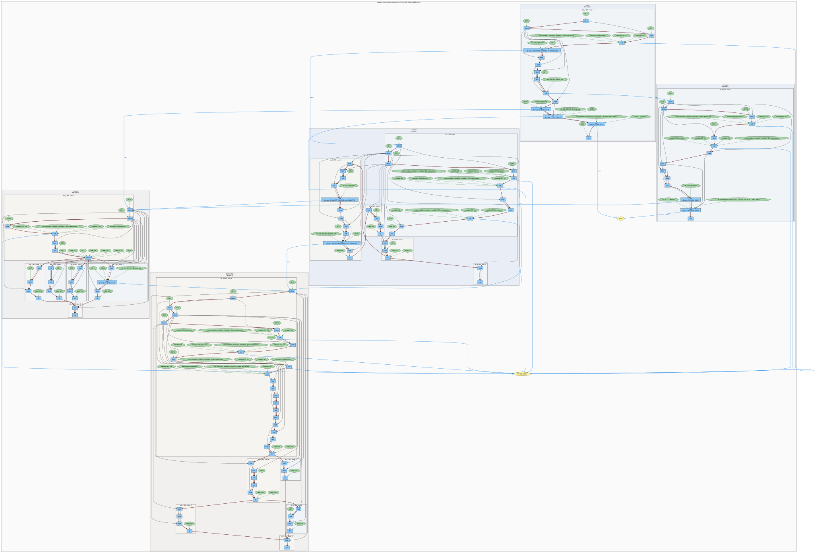

# FlowSketch — CFG / DFG from LLVM IR

FlowSketch is a self-contained teaching lab: one LLVM **New PM** plugin (`FlowSketchPass`) exports a compact graph description from a module, injects tiny profiling hooks, and a small **offline** tool merges the static graph with an execution log to produce **Graphviz DOT**.

## What problem this solves

- **CFG (control-flow graph)**: how instructions and basic blocks execute next (in-order steps inside a block, conditional branches, `switch`, calls as blue inter-procedure edges).
- **DFG (data-flow graph)**: which SSA values flow into which instructions (uses/defs), drawn as dark edges between instruction nodes.
- **Constants / parameters**: non-instruction operands become green value nodes with green use edges into the consumer instruction.
- **Dynamic heatmap**: after you run the instrumented program, function / basic-block clusters can be tinted by visit counts (hotter ≈ more red).

## Where LLVM fits

LLVM gives you the program in **SSA form** as a `Module` → `Function` → `BasicBlock` → `Instruction` hierarchy. The pass walks that IR, assigns **stable synthetic ids** (`F{func}B{block}I{index}`), and encodes edges that would be tedious to recover from C/C++ source alone. IR is the ground truth for control flow (terminators, block layout) and data flow (`Instruction::uses()` / operands).

**Layout of this repo:**

- tab-separated `log/static.flow.txt` with an explicit version header;
- stable hierarchical ids for instructions;
- `flowsketch-merge` turns static + dynamic logs into Graphviz DOT;
- runtime hooks in `runtime/flowsketch_rt.c` (`__flowsketch_*`).

## Sample graph (CFG + DFG + dynamic overlays)

The figure below is checked into `docs/flowsketch_sample.svg` (generated from [`examples/advanced.c`](examples/advanced.c) with the default demo script). Blue **call** edges show `calls:N`; some `call` nodes include a **trace** line with the logged return bits; clusters show **FN visits** / **runs:**.



**Updating the screenshot:** after changing the pass or sample, run `sh scripts/run_demo.sh` and copy `log/flowsketch.svg` to `docs/flowsketch_sample.svg`.

## Build

Requirements (Debian/Ubuntu-style):

- `clang`, `llvm-14` (or matching `opt` for your LLVM), `cmake`, `g++`, `graphviz` (optional, for `dot`).

Fetch headers once (no root needed):

```sh
cd "/path/to/LLVM_Pass"
apt-get download llvm-14-dev
dpkg-deb -x llvm-14-dev_*.deb .llvm-hdrs
```

### CMake

```sh
cmake -S . -B build -DCMAKE_BUILD_TYPE=Release
cmake --build build
```

The plugin is `build/libFlowSketchPass.so` (CMake’s default MODULE name). You can also use the manual wrapper:

```sh
sh scripts/build_plugin.sh build/libFlowSketchPass.so
```

## One-shot demo

```sh
sh scripts/run_demo.sh                    # uses examples/advanced.c
sh scripts/run_demo.sh examples/demo.c    # smaller toy program
dot -Tsvg log/flowsketch.dot -o log/flowsketch.svg
```

Open `log/flowsketch.svg` in a browser or Inkscape.

## Manual pipeline

1. Produce bitcode:

   ```sh
   clang -emit-llvm -c -O0 -g -Xclang -disable-O0-optnone -o app.bc app.c
   ```

2. Run the pass (writes `log/static.flow.txt` and instruments IR):

   ```sh
   opt -load-pass-plugin=build/libFlowSketchPass.so -passes='default<O0>' -S -o app.ll app.bc
   ```

   You can also request the pass by name: `-passes='flowsketch'` after loading the plugin.

3. Compile the instrumented IR with the runtime (`runtime/flowsketch_rt.c`).

4. Run the binary from the project root so `log/dynamic.flow.log` lands next to `log/static.flow.txt`.

5. Merge → DOT:

   ```sh
   ./build/flowsketch-merge log/static.flow.txt log/dynamic.flow.log log/flowsketch.dot
   ```

## How to read the graph

| Visual element | Meaning |
|----------------|---------|
| Nested grey/blue clusters | Module → function → basic block |
| Light-blue boxes | LLVM instructions (opcode text only) |
| Green ellipses | Constants / non-instruction operands |
| Yellow ovals | External functions (declarations) |
| **Red** arrows | CFG (instruction order, branches, switches) |
| **Black** arrows | DFG (producer instruction → consumer instruction) |
| **Blue** arrows | Calls (into callee entry or external stub) |
| **Green** thin arrows | Constant/value flowing into an instruction |
| Cluster labels `runs:` / `FN visits:` | Dynamic counters (0 if you skipped execution) |

### How to analyze it sanely

1. Pick a function cluster — it isolates one compilation unit slice.
2. Inside a basic block, follow **red** edges top-to-bottom: that is the concrete schedule LLVM chose inside the block before the terminator fires.
3. Follow **black** DFG edges backward from an instruction to see where its SSA inputs originate (useful for understanding `phi`, arithmetic chains, loads).
4. Blue call edges tell you *who* the instruction invokes; pair that with the green external nodes for libc / unknown symbols.
5. Compare dynamic heatmaps before/after an optimization pass or input change — hotter blocks should dominate in realistic workloads.

### Dynamic extras (profiling run)

- **Call edges (blue):** if the log contains `CALL func bb instr`, the merger counts executions **per static call instruction** and draws `calls:N` on the matching `call → callee` edge.
- **Runtime values:** after each non-void scalar `call`, the pass logs `VAL func bb instr bits` (raw `i64` payload: integers are zero-extended, floats are bitcast). The instruction’s node label gets an extra line `\n@ trace: …`.

## File map

- `pass/FlowSketchPass.cpp` — LLVM pass (export + instrumentation).
- `runtime/flowsketch_rt.c` — append-only textual log.
- `tools/flowsketch_merge.cpp` — static+dynamic → DOT.
- `log/static.flow.txt` — rewritten each `opt` invocation.
- `log/dynamic.flow.log` — produced at runtime (overwrite mode).

## License

Educational / reference — use and adapt with attribution.
